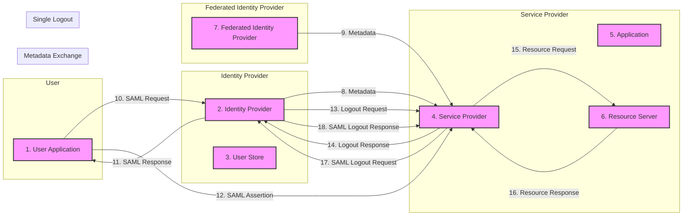

# MermaidConcepts

```mermaid
graph LR;

subgraph User
    A[1. User Application];
    style A fill:#f9f, stroke:#333, stroke-width:2px;
end;

subgraph Identity Provider
    B[2. Identity Provider];
    C[3. User Store];
    style B fill:#f9f, stroke:#333, stroke-width:2px;
    style C fill:#f9f, stroke:#333, stroke-width:2px;
end;

subgraph Service Provider
    D[4. Service Provider];
    E[5. Application];
    F[6. Resource Server];
    style D fill:#f9f, stroke:#333, stroke-width:2px;
    style E fill:#f9f, stroke:#333, stroke-width:2px;
    style F fill:#f9f, stroke:#333, stroke-width:2px;
end;

subgraph Federated Identity Provider
    G[7. Federated Identity Provider];
    style G fill:#f9f, stroke:#333, stroke-width:2px;
end;

subgraph Metadata Exchange
    B -- 8. Metadata --> D;
    G -- 9. Metadata --> D;
end;

subgraph Single Logout
    B -- 13. Logout Request --> D;
    D -- 14. Logout Response --> B;
end;

A -- 10. SAML Request --> B;
B -- 11. SAML Response --> A;
A -- 12. SAML Assertion --> D;
D -- 15. Resource Request --> F;
F -- 16. Resource Response --> D;
D -- 17. SAML Logout Request --> B;
B -- 18. SAML Logout Response --> D;

```
